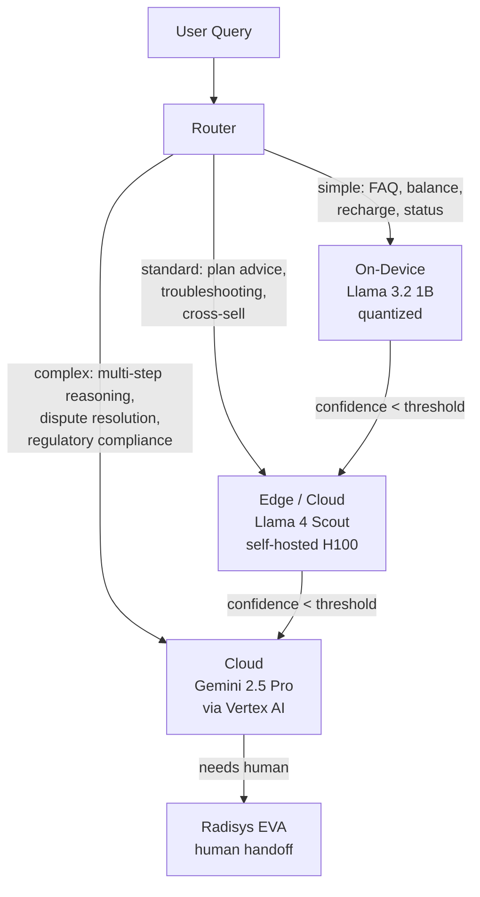
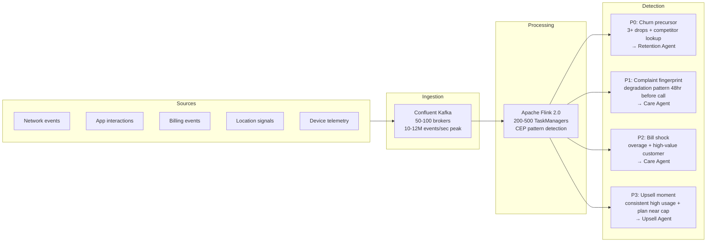
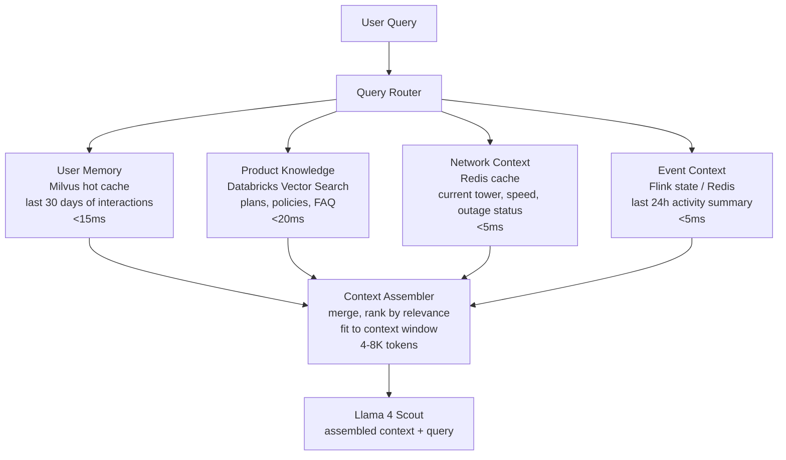
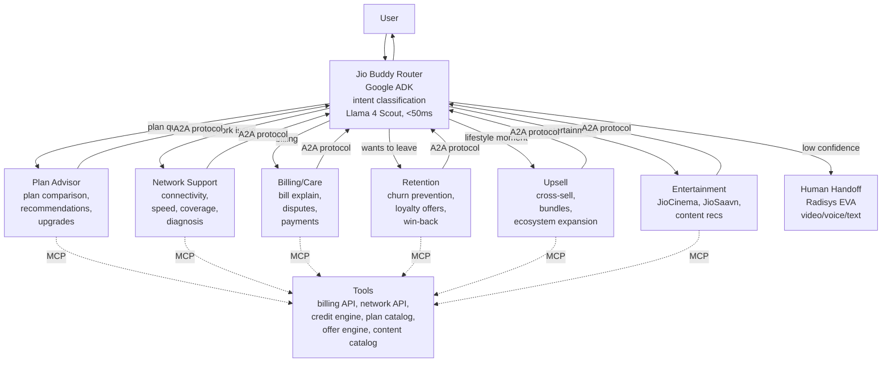

# Jio Buddy — Production Architecture

## 1. Scale Requirements

| Metric | Value |
|--------|-------|
| Subscribers | 500M |
| Daily active AI users (1% baseline) | 5M |
| Daily active AI users (5% target) | 25M |
| Events per customer per day | 600-700 |
| Total events per month | ~9-10 trillion |
| Peak event throughput | 10-12M events/sec |
| Monthly inference tokens (1% DAU) | 480B (180B input + 300B output) |
| Memory storage (all users) | 200-300TB |
| Languages required | 10+ (Hindi, English, Tamil, Telugu, Bengali, Marathi, Kannada, Malayalam, Gujarati, Punjabi) |

## 2. Technology Stack

Every stack choice is aligned with Jio's shareholder relationships. This is not a vendor selection exercise. The cap table implies the architecture.

| Layer | Technology | Rationale |
|-------|-----------|-----------|
| **Primary LLM** | Llama 4 Scout (self-hosted) | Meta owns 9.99% of JPL. REIL JV ($100M, 70/30 Reliance/Meta) purpose-built for Llama enterprise AI. Scout fits single H100. 20-200x cheaper than API models at this volume. |
| **Escalation LLM** | Gemini 2.5 Pro (via Vertex AI) | Google owns 7.73% of JPL. Gemini Pro bundled free with Jio 5G plans. Complex reasoning fallback for edge cases. |
| **On-device LLM** | Llama 3.2 1B/3B (quantized) | Runs on 60%+ of Indian smartphones (2GB+ RAM). Zero marginal inference cost. Offline capability. Privacy-preserving. |
| **Orchestration** | Google ADK v1.0.0 | Production-ready. Native MCP + A2A support. Deploys to Vertex AI Agent Engine (managed, auto-scaling). Google partnership aligned. |
| **Tool integration** | MCP (Model Context Protocol) | Industry standard. ADK has native McpToolset. Connects agents to billing, network, CRM APIs. |
| **Inter-agent comms** | A2A Protocol v0.3 | Google-backed, 150+ org ecosystem. gRPC support. How specialist agents communicate. |
| **Event streaming** | Confluent Kafka + Apache Flink 2.0 | Kafka: proven at millions of events/sec. Flink: stateful stream processing, exactly-once semantics, CEP for pattern detection. |
| **Data platform** | Databricks (Delta Lake + Unity Catalog) | Already Jio's data platform. 180K+ attributes. Feature store. MLflow. Structured Streaming for analytics. |
| **Vector search** | Databricks Vector Search (primary) + Milvus (hot cache) | Databricks: billion-scale, integrated with lakehouse, auto-sync from Delta. Milvus: sub-15ms retrieval for active conversations. |
| **ASR** | IndicWhisper (self-hosted) | Best accuracy for Indian languages (39/59 Vistaar benchmarks). Open-source. Sovereign deployment. Google Chirp as fallback. |
| **TTS** | Indic-Parler-TTS (self-hosted) | 13 Indian languages. FastPitch + HiFi-GAN. 75-150ms latency. Google Cloud TTS for premium interactions. |
| **Video escalation** | Radisys EVA | Already deployed at 370M+ Jio users. App-less video/voice bot. ViLTE on 4G/5G. Jio subsidiary. |
| **Monitoring** | Vertex AI evaluation + Databricks MLflow | Agent observability, drift detection, A/B testing. |

## 3. Inference Architecture

Three tiers, routed by complexity and latency requirements:

### GPU Infrastructure

| Component | Spec |
|-----------|------|
| Primary model | Llama 4 Scout (17B active / 109B total, MoE) |
| GPU per instance | 1x NVIDIA H100 80GB |
| Serving framework | vLLM with PagedAttention |
| Cluster size (1% DAU) | 200-400 H100 GPUs |
| Cluster size (5% DAU) | 800-1500 H100 GPUs |
| On-premise option | 40-50 DGX H200 systems ($16-25M capex) |

### Latency Budget

| Stage | Target | Max |
|-------|--------|-----|
| Request routing + auth | <10ms | 20ms |
| Context retrieval (RAG) | <50ms | 100ms |
| LLM time to first token | <200ms | 400ms |
| LLM full generation (250 tokens) | <1.5s | 3s |
| **Total text response** | **<1.8s** | **3.5s** |
| **Total voice pipeline (ASR+LLM+TTS)** | **<800ms** | **1.5s** |

### On-Device Strategy

60%+ of Jio's 500M subscribers use phones with 2-4GB RAM. Llama 3.2 1B quantized (SpinQuant, ~600MB) runs on these devices.

On-device handles: balance checks, plan info, FAQ, basic self-serve. Zero marginal cost per inference. Works offline. Data stays on device.

When the query exceeds on-device capability, it escalates to edge/cloud with the on-device conversation context forwarded.

## 4. Event Processing

### Pattern Detection via Flink CEP

| Pattern | Events | Window | Agent Triggered | Action |
|---------|--------|--------|-----------------|--------|
| Churn precursor | 3+ dropped calls + data speed complaint + competitor plan lookup | 7 days | Retention | Proactive offer + network remediation |
| Complaint fingerprint | Repeated connectivity issues in same cell area | 24 hours | Care | Acknowledge + ETA + credit |
| Bill shock | Overage alert + plan limit approach + high-value customer | Real-time | Care | Proactive notification + upgrade offer |
| Upsell moment | Consistent high data + OTT usage + plan near capacity | 30 days | Upsell | Personalised plan recommendation |
| Silent sufferer | Below-threshold network quality + zero care contacts | 14 days | Retention | Proactive check-in |

### Infrastructure Sizing

| Component | Spec |
|-----------|------|
| Kafka cluster | 50-100 brokers, 3x replication, ~500TB storage |
| Flink cluster | 200-500 TaskManagers, 64GB RAM each |
| Throughput | 10-12M events/sec sustained (peak) |
| Latency (ingestion to pattern) | <500ms for P0, <5s for P1-P3 |
| Raw event retention | 30 days (~2PB) |

## 5. Memory / RAG Architecture

### Storage by Type

| Data | Per User | Total (500M) |
|------|----------|-------------|
| User profile (structured) | 2-5KB | 1-2.5TB |
| Interaction history (90 days) | 50-200KB | 25-100TB |
| Embedding vectors (1536-dim, ~50 per user) | 300KB | 150TB |
| Network context | 1-5KB | 0.5-2.5TB |
| Shared knowledge base (plans, products, policies) | — | 10-50GB |
| **Total** | | **~200-300TB** |

### Three-Tier Memory

| Tier | Storage | TTL | Use |
|------|---------|-----|-----|
| **Hot** | Redis / Memcached | Session | Active conversation state, current intent |
| **Warm** | Milvus (vector DB) | 90 days | Recent conversation recall, preference vectors |
| **Cold** | Databricks Delta Lake | Indefinite | Full history, analytics, retraining, compliance |
| **Shared** | Databricks Vector Search | Updated daily | Plan/product knowledge, policies, FAQ |

### Per-User Context Assembly

### Retrieval Latency

| Operation | Target | Max |
|-----------|--------|-----|
| User profile lookup | <5ms | 10ms |
| Vector similarity (top-10) | <15ms | 30ms |
| Knowledge base retrieval | <20ms | 40ms |
| Network context | <5ms | 10ms |
| **Total retrieval** | **<50ms** | **100ms** |

## 6. Multi-Language Voice Pipeline

### Language Priority

| Priority | Languages | Est. Users |
|----------|-----------|-----------|
| P0 | Hindi, English | 400M+ |
| P0 | Tamil, Telugu, Bengali | 135M+ |
| P1 | Marathi, Kannada, Malayalam, Gujarati | 120M+ |
| P2 | Punjabi, Odia, Assamese | 30M+ |

### Pipeline

| Stage | Technology | Latency |
|-------|-----------|---------|
| ASR (speech → text) | IndicWhisper (self-hosted, streaming) | 150ms |
| LLM (text → response) | Llama 4 Scout (streaming output) | 300-500ms |
| TTS (response → speech) | Indic-Parler-TTS (self-hosted, streaming) | 75-100ms |
| Network | Jio 5G / edge | 50ms |
| **End-to-end** | **Streaming parallelism** | **575-850ms** |

With streaming parallelism (ASR streams to LLM, LLM streams to TTS), effective perceived latency drops to 400-600ms. Within human perception threshold.

Code-switching (Hindi-English "Hinglish") is the default for ~40% of Indian users. Models must handle mixed-language input natively. Llama 4 Scout handles this. IndicWhisper handles mixed-language ASR.

## 7. Agent Orchestration

### Routing

1. **Intent classification** (Llama 4 Scout, <50ms): classify user query into domain
2. **Skill-based routing**: route to specialist agent with highest confidence score
3. **Context handoff**: conversation history + user profile + relevant events forwarded via A2A
4. **Escalation**: specialist confidence < threshold → human handoff via Radisys EVA (370M+ users, no app needed)

### Tool Integration via MCP

Each backend system exposes tools via MCP server:

| MCP Server | Tools | Rate Limit |
|------------|-------|-----------|
| Billing | get_balance, get_bill, apply_credit, process_payment | 100K req/s |
| Network | check_speed, tower_status, diagnose_connection, report_outage | 50K req/s |
| Plans | compare_plans, check_eligibility, initiate_switch | 50K req/s |
| Offers | get_personalised_offers, apply_offer, check_loyalty_points | 30K req/s |
| Content | get_recommendations, check_subscription, browse_catalog | 20K req/s |
| Customer | get_profile, update_preferences, opt_in_proactive | 50K req/s |

Circuit breakers on all tool calls. Async parallel execution where possible.

## 8. Cost Model

### Per Subscriber Per Month

| Component | Monthly Cost | Per Subscriber (500M) | Per Active User (5M DAU) |
|-----------|-------------|----------------------|-------------------------|
| LLM inference (self-hosted Llama) | $200-400K | $0.0004-$0.0008 | $0.04-$0.08 |
| GPU infrastructure (300 H100s) | $650-750K | $0.0013-$0.0015 | $0.13-$0.15 |
| Vector DB + RAG | $100-200K | $0.0002-$0.0004 | $0.02-$0.04 |
| Event processing (Kafka + Flink) | $300-500K | $0.0006-$0.001 | $0.06-$0.10 |
| ASR/TTS (voice, ~20% of users) | $150-300K | $0.0003-$0.0006 | $0.03-$0.06 |
| Storage (300TB) | $50-100K | $0.0001 | $0.01-$0.02 |
| Monitoring, ops, overhead | $200-300K | $0.0004 | $0.04-$0.06 |
| **Total** | **$1.65-2.55M/month** | **$0.003-$0.005** | **$0.33-$0.51** |

**$17-28M per year total infrastructure cost.**

### ROI

| Metric | Value |
|--------|-------|
| Annual subscriber revenue (500M x $30 ARPU) | ~$15B |
| Annual AI infrastructure cost | $17-28M |
| Cost as % of revenue | 0.1-0.2% |
| If AI reduces churn by 0.1% (saves 500K subscribers) | **$30M/year saved** |
| If AI reduces call center load by 30% | **$100-200M/year saved** |
| **Year 1 ROI** | **5-10x** |

Reference: Telefonica achieved 90% cost reduction ($3.50 → $0.35 per interaction) with AI agents handling 900K+ additional voice calls.

### AI Agent vs Human Agent vs Churn

| Metric | AI Agent | Human Agent (India) |
|--------|---------|-------------------|
| Cost per interaction | $0.02-$0.05 | $0.50-$2.00 |
| Cost per minute (voice) | $0.08-$0.15 | $0.42-$1.08 |
| Daily capacity | Unlimited (auto-scale) | 40-60 per agent |
| Availability | 24/7/365 | Shift-based |
| Languages | 10+ simultaneous | 1-2 per agent |

## 9. Integration Requirements

What we need from Jio before we can build:

| Requirement | From | Blocks | Priority |
|-------------|------|--------|----------|
| Databricks workspace access (read) | Manoj Mhatre / Rahul Joshi | Everything | P0 |
| MCP agent framework maturity assessment | Aayush Bhatnagar | Orchestration design | P0 |
| Action API catalog (credit, notification, plan switch) | Jio operations / Puneet Kathuria | Proactive interventions | P0 |
| HelloJio/Haptik NLU documentation | Care team | Build-on vs replace decision | P1 |
| MyJio app integration spec (where Buddy lives in UI) | Jio product | Frontend design | P1 |
| DPDPA compliance framework for persistent memory | Jio legal + infosec | Memory layer design | P1 |
| Consent model for proactive outreach at scale | Jio regulatory | Proactive comms | P1 |
| Call recording samples (infosec approval pending) | Rahul Joshi | Voice pipeline training | P2 |
| JioGridX per-customer network quality API | Network squad | Network-triggered interventions | P2 |

## 10. Open Questions

| Question | Impact | How We Resolve |
|----------|--------|---------------|
| Are the 5 MCP agents deployed or still in design? | Determines integration vs parallel build | Inspect Databricks workspace + ask Aayush |
| What is Haptik's actual NLU coverage and accuracy? | Replace vs extend decision | Request Haptik documentation |
| What's the real event schema? | Everything in the data pipeline | Run Basecamp on Databricks (Phase 1) |
| Does REIL JV give us access to fine-tuned Llama models? | May already have telecom-tuned Llama | Ask via Jio AI team |
| What's the consent model for proactive outreach? | Can't send 500M unsolicited messages | Jio legal + DPDPA review |
| What GPU infrastructure does Jio already have? | May not need to provision 300 H100s | Ask Aayush about existing AI compute |
| How mature is Jio's Confluent/Kafka deployment? | May already have event streaming at scale | Data team walkthrough |
| What's Radisys EVA's current handoff latency? | Determines escalation UX | Test with Jio voice infra |

## 11. Not in Scope (100 Days)

- Full Jio OS (5 life modes). 12-month vision, not 100-day deliverable.
- Network squad work (autonomous network optimisation). Separate pod.
- Production deployment at 500M scale. June 30 is a showcase with real data, not a launch.
- On-device model deployment. Requires handset partnerships and app distribution. Post-100-day.
- Kirana commerce, MVNO, token network. Separate workstreams.
